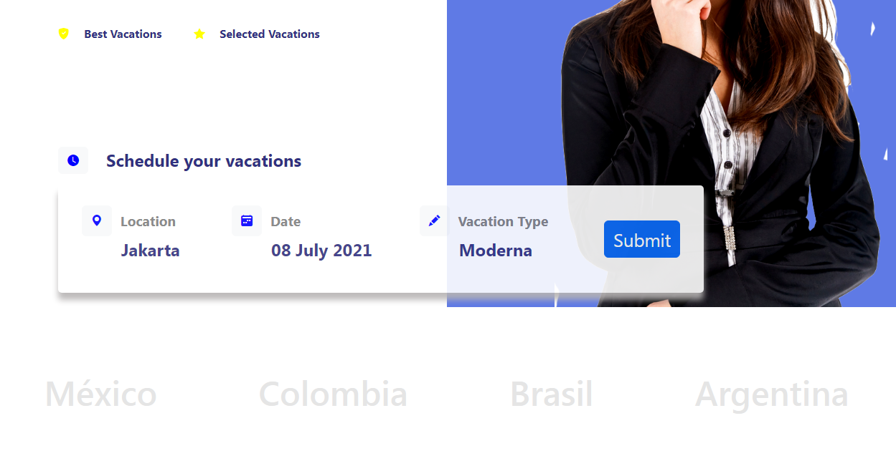
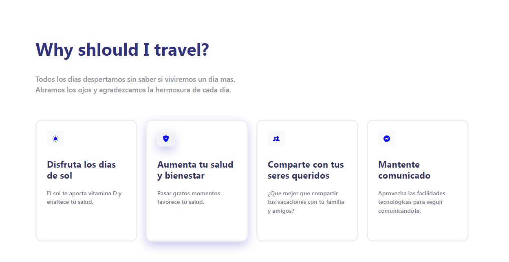
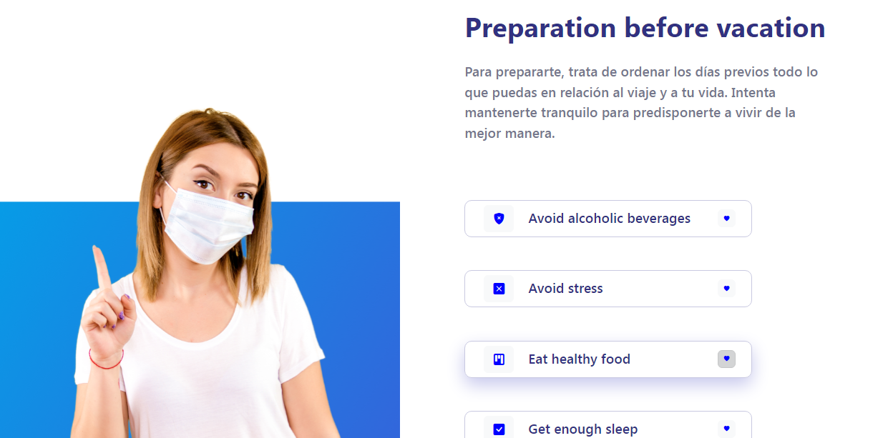
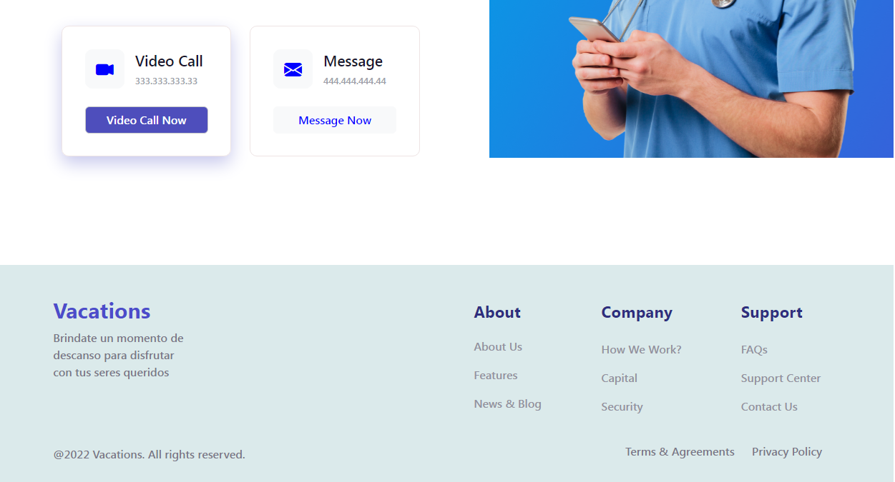

# ***"Vacations"*** - Práctica3 - Clon de Página - CSS - LaunchX

## "Vacations" 

Modifiqué el contenido de la página pero los estilos se mantuvieron clonando la original.

[Captura de Página Original a clonar](https://github.com/Launch-X-Latam/MisionFrontEnd/blob/main/03%20-%20CSS/practica/landingVacunaci%C3%B3n.png?raw=true)

La página clonada por el momento no es responsive.
Trabajé en una compu de pantalla pequeña de 1280px x 800px, por lo que el diseño esta fiel a ese tamaño de pantalla.

### Página clonada

La página esta deployada en: [Clon Page Vacations](https://clonpage-vacations.netlify.app/)

A continuación, se muestran las capturas de las diferentes secciones de la página CLONADA.

Captura 1 

Captura 2 

Captura 3 

Captura 4 

Captura 5 

Captura 6 

[Volver](../README.md)
